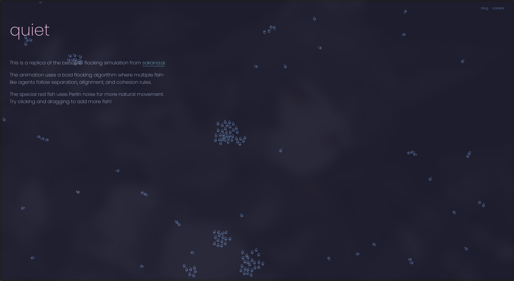

# Sakana.ai Replica

A beautiful interactive flocking simulation inspired by the [sakana.ai](https://sakana.ai) website. This project implements a boid flocking algorithm where multiple fish-like agents follow separation, alignment, and cohesion rules to create a mesmerizing animation.



## Features

- **Boid Flocking Algorithm**: Simulates natural flocking behavior using three key rules:
  - **Separation**: Steer to avoid crowding local flockmates
  - **Alignment**: Steer towards the average heading of local flockmates
  - **Cohesion**: Steer to move toward the average position of local flockmates

- **Special Red Fish**: A unique fish that uses Perlin noise for more natural and organic movement patterns

- **Interactive**: Click and drag on the canvas to add more fish to the simulation (up to 250)

- **Responsive Design**: Adapts beautifully to different screen sizes

## Technologies Used

- **HTML5/CSS3**: For structure and styling
- **JavaScript**: For the core simulation logic
- **p5.js**: A JavaScript library for creative coding and visualization
- **Catppuccin Mocha**: Color palette for a cohesive visual theme

## How to Use

1. Open `index.html` in any modern web browser
2. Watch the fish swim and interact with each other
3. Click and drag on the canvas to add more fish to the simulation
4. Enjoy the mesmerizing patterns created by the flocking behavior

## Project Structure

```
sakana-replica/
├── css/
│   └── style.css       # Styling for the page
├── js/
│   ├── p5.min.js       # p5.js library
│   └── sketch.js       # Core simulation logic
├── index.html          # Main HTML document
└── README.md           # This documentation
```

## How It Works

The simulation is based on Craig Reynolds' Boids algorithm, which models flocking behavior using three simple rules:

1. **Separation**: Each fish tries to maintain a small distance from other fish to avoid crowding
2. **Alignment**: Each fish steers towards the average heading of nearby fish
3. **Cohesion**: Each fish moves toward the center of mass of nearby fish

The special red fish (Sakana) uses Perlin noise to create more natural, organic movement patterns instead of following the flocking rules.

## Credits

- Original inspiration: [sakana.ai](https://sakana.ai)
- Boids algorithm: Craig Reynolds
- p5.js library: [p5js.org](https://p5js.org)
- Color palette: [Catppuccin Mocha](https://github.com/catppuccin/catppuccin)

## License

Do whatever you want, lil bro